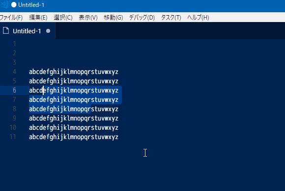

# vscode-insert-beginning-of-line

## Features

Inserts the specified word at the beginning of the line in the selected range.

## Available Command
* extension.insertBeginningOfLine : Insert the word entered at the beginning of the selected range.

## Extension Settings

| parameter name                          | description         | type   | default value |
| --------------------------------------- | ------------------- | ------ | ------------- |
| insertBeginningOfLine.defaultInsertWord | Default insert word | string | "> "          |

